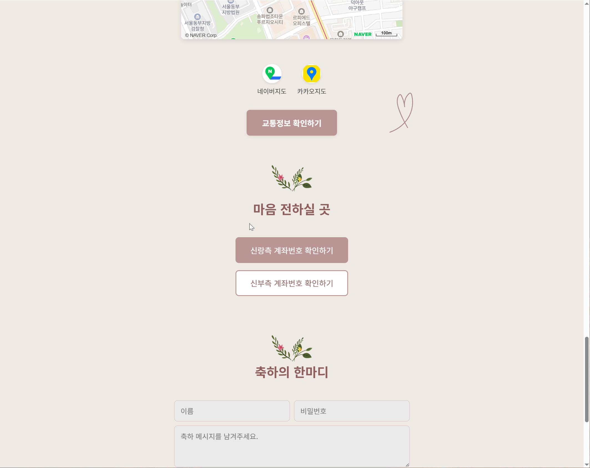
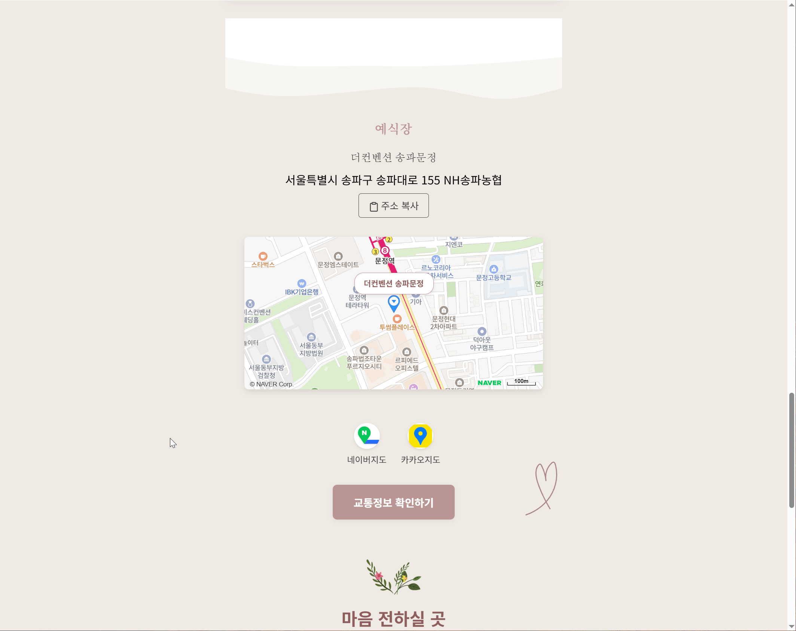

# 모바일 청첩장 설명

이 프로젝트는 SvelteKit과 Firebase를 활용하여 개발된 모바일 청첩장 웹 애플리케이션입니다. 소중한 순간을 공유하고, 하객들이 편리하게 정보를 확인하고 축하 메시지를 남길 수 있도록 다양한 기능을 제공합니다.

## 🌐 데모

[여기](https://wedding-invitation-kth9916.pages.dev/)에서 배포된 프로젝트를 확인하실 수 있습니다.

## 🚀 주요 기능

-   **다국어 지원**: `svelte-i18n`을 통해 한국어를 지원하며, 필요에 따라 다른 언어를 추가할 수 있습니다.
-   **방명록**: 하객들이 이름, 비밀번호, 메시지를 남길 수 있으며, 비밀번호를 통해 본인이 작성한 메시지를 삭제할 수 있습니다. (중복 제출 방지 및 공백 입력 방지 기능 포함)

    <details>
    <summary>방명록 기능 GIF 보기</summary>

    

    </details>
    
-   **계좌 정보**: 신랑/신부측의 계좌 정보를 제공하며, 탭 한 번으로 계좌번호를 복사할 수 있습니다.

    <details>
    <summary>계좌 정보 기능 GIF 보기</summary>

    

    </details>
-   **갤러리**: 결혼 사진들을 모아 볼 수 있으며, 사진을 탭하면 확대하여 볼 수 있습니다.

    <details>
    <summary>갤러리 기능 GIF 보기</summary>

    

    </details>
-   **위치 정보**: 예식장 위치를 지도(Naver Map, Kakao Map, TMap 연동)로 제공하며, 대중교통 및 주차 정보를 상세하게 안내합니다. 주소 복사 기능도 포함되어 있습니다.

    <details>
    <summary>위치 정보 기능 GIF 보기</summary>

    

    </details>
-   **Confetti 효과**: 페이지 진입 시 및 특정 이벤트 발생 시 하트 모양의 컨페티 효과를 통해 축제 분위기를 연출합니다.

    <details>
    <summary>Confetti 효과 GIF 보기</summary>

    

    </details>
-   **반응형 디자인**: 모바일 및 PC 환경에서 최적화된 사용자 경험을 제공합니다.
-   **Google Analytics 연동**: 페이지 뷰 및 특정 이벤트(예: 커버 페이지 조회)를 추적합니다.

## 🛠️ 기술 스택

-   **프레임워크**: [SvelteKit](https://kit.svelte.dev/)
-   **언어**: [TypeScript](https://www.typescriptlang.org/)
-   **데이터베이스**: [Firebase Firestore](https://firebase.google.com/docs/firestore)
-   **배포**: [Cloudflare Pages](https://pages.cloudflare.com/) (Wrangler CLI 사용)
-   **스타일**: [Sass](https://sass-lang.com/)
-   **상태 관리**: Svelte Stores
-   **국제화**: [svelte-i18n](https://github.com/kaisermann/svelte-i18n)
-   **애니메이션**: [svelte-confetti](https://github.com/srmagura/svelte-confetti)

## 📦 설치 및 실행

프로젝트를 로컬에서 실행하려면 다음 단계를 따르세요.

1.  **저장소 클론**: 
    ```bash
    git clone https://github.com/kth9916/wedding-invitation-kth9916.git
    cd wedding-invitation-kth9916
    ```

2.  **의존성 설치**: `pnpm`을 사용하여 의존성을 설치합니다.
    ```bash
    pnpm install
    ```

3.  **환경 변수 설정**: 프로젝트 루트에 `.env` 파일을 생성하고 다음 환경 변수를 설정합니다.
    ```env
    VITE_KAKAO_JS_KEY="YOUR_KAKAO_JAVASCRIPT_KEY"
    VITE_FIREBASE_API_KEY="YOUR_FIREBASE_API_KEY"
    VITE_FIREBASE_AUTH_DOMAIN="YOUR_FIREBASE_AUTH_DOMAIN"
    VITE_FIREBASE_PROJECT_ID="YOUR_FIREBASE_PROJECT_ID"
    VITE_FIREBASE_STORAGE_BUCKET="YOUR_FIREBASE_STORAGE_BUCKET"
    VITE_FIREBASE_MESSAGING_SENDER_ID="YOUR_FIREBASE_MESSAGING_SENDER_ID"
    VITE_FIREBASE_APP_ID="YOUR_FIREBASE_APP_ID"
    VITE_FIREBASE_MEASUREMENT_ID="YOUR_FIREBASE_MEASUREMENT_ID"
    VITE_NAVER_MAPS_CLIENT_ID="YOUR_NAVER_MAPS_CLIENT_ID"
    ```
    *   `VITE_KAKAO_JS_KEY`: 카카오 개발자 웹사이트에서 발급받은 JavaScript 키입니다.
    *   `VITE_FIREBASE_...`: Firebase 프로젝트 설정에서 얻을 수 있는 값들입니다.

4.  **개발 서버 실행**: 
    ```bash
    pnpm dev
    ```
    브라우저에서 `http://localhost:5173` (또는 콘솔에 표시되는 주소)로 접속하여 개발 환경을 확인할 수 있습니다.

5.  **빌드**: 프로덕션 배포를 위한 빌드 파일을 생성합니다.
    ```bash
    pnpm build
    ```
    빌드된 파일은 `dist/` 디렉토리에 생성됩니다.

6.  **미리보기 (Cloudflare Workers)**: Cloudflare Workers 환경에서 빌드된 앱을 미리 볼 수 있습니다.
    ```bash
    pnpm preview
    ```

7.  **타입 생성 (Cloudflare Workers)**: Cloudflare Workers를 위한 타입 정의 파일을 생성합니다.
    ```bash
    pnpm cf-typegen
    ```

8.  **배포 (GitHub Pages)**: 빌드된 프로젝트를 GitHub Pages로 배포합니다.
    ```bash
    pnpm deploy
    ```

## 🤝 기여

이 프로젝트에 기여하고 싶으시다면, 언제든지 Pull Request를 보내주세요. 버그 리포트나 기능 제안도 환영합니다.

## 📄 라이선스

이 프로젝트는 MIT 라이선스 하에 배포됩니다. 자세한 내용은 `LICENSE` 파일을 참조하세요. (현재 `LICENSE` 파일은 없으므로, 필요시 추가해야 합니다.)
